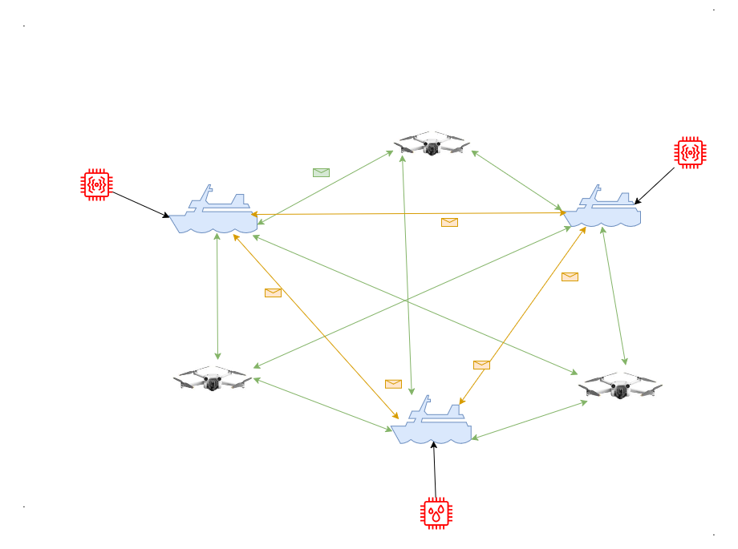

# 🌊 Maritime P2P — Sistema Distribuído de Monitoramento Marítimo





> **Um sistema P2P que coordena sensores, setores e drones para responder a incidentes no mar sem um servidor central.**


---


## 📚 Sumário

1. [Resumo em uma frase](#-resumo-em-uma-frase)
2. [A ideia do Maritime P2P](#-a-ideia-do-maritime-p2p)
3. [Visão geral da arquitetura](#-visão-geral-da-arquitetura)
4. [Como o sistema foi construído](#-como-o-sistema-foi-construído)
5. [Componentes do sistema](#-componentes-do-sistema)
6. [Fluxo de funcionamento (passo a passo)](#-fluxo-de-funcionamento-passo-a-passo)
7. [Algoritmo distribuído: Ricart–Agrawala](#-algoritmo-distribuído-ricartagrawala)
8. [Prioridades, preempção e fila global](#-prioridades-preempção-e-fila-global)
9. [Tolerância a falhas e reconexão](#-tolerância-a-falhas-e-reconexão)
10. [Segurança e autenticação](#-segurança-e-autenticação)
11. [Protocolo de mensagens (JSON)](#-protocolo-de-mensagens-json)
12. [Executando com Docker Compose](#-executando-com-docker-compose)
13. [Executando com Makefile](#-executando-com-makefile)
14. [Variáveis de ambiente](#-variáveis-de-ambiente)
15. [Estrutura do repositório](#-estrutura-do-repositório)
16. [Comandos do Shell do Setor](#-comandos-do-shell-do-setor)
17. [Testes](#-testes)
18. [Limitações e melhorias recomendadas](#-limitações-e-melhorias-recomendadas)

---

## ✅ Resumo em uma frase

**O Maritime P2P coordena, de forma descentralizada, o envio de drones para missões marítimas usando prioridades, algoritmos distribuídos e autenticação segura via TCP.**

---

## A ideia do Maritime P2P

Imagine várias **bases costeiras (Setores)**, cada uma com **drones de resgate**. Vários **sensores** espalhados pelo oceano enviam alertas o tempo todo. Se todas as bases decidirem enviar drones ao mesmo tempo para o mesmo incidente, ocorre confusão. Se nenhuma enviar, o problema piora.

O **Maritime P2P** resolve isso de forma inteligente: as bases conversam entre si e decidem **quem pode agir primeiro**, sem precisar de um “chefe central”. Emergências reais têm prioridade maior e podem interromper tarefas menos importantes.

---

## 🏗️ Visão geral da arquitetura

O projeto é um **sistema distribuído** com **comunicação via TCP**, seguindo o modelo **P2P**. Ele foi construído como um **Elixir**, com quatro aplicações principais:

- **`sector`** → o cérebro distribuído (coordena a decisão coletiva)
- **`drone`** → executa as missões físicas
- **`sensors`** → gera alertas e requisições
- **`core`** → protocolos, tipos de mensagens e autenticação

---

## 🛠️ Como o sistema foi construído

**Tecnologias principais:**
- **Elixir**: concorrência leve e tolerância a falhas.
- **TCP Sockets** com mensagens **JSON line-delimited** (uma mensagem por linha).
- **Arquitetura distribuída** sem servidor central.
- **Algoritmo de Ricart–Agrawala** para exclusão mútua.
- **Prioridades e preempção** para emergências.
- **Autenticação** com SHA‑256 (passkey).

O sistema é totalmente orientado a eventos: cada mensagem recebida por TCP é transformada em uma struct, processada em um **GenServer** e encaminhada para o fluxo certo.

---

## 🧩 Componentes do sistema

### 1. 🏢 Setores (`apps/sector`)
São os **nós distribuídos**. Cada setor decide quando pode entrar na **Seção Crítica** (o direito de enviar drones).

Principais módulos:
- `Sector.Node`: coração do algoritmo distribuído.
- `Sector.TcpServer`: recebe mensagens TCP.
- `Sector.TcpClient`: conecta em outros setores.
- `Sector.Shell`: interface interativa local.
- `Sector.NodeId`: identifica o nó para mensagens internas.

### 2. 🚁 Drones (`apps/drone`)
Representam executores das missões.

Principais módulos:
- `Drone.TcpClient`: conecta a setores e recebe missões.
- `Drone.Worker`: gerencia o estado (`IDLE`/`BUSY`) e executa missões.

### 3. 📡 Sensores (`apps/sensors`)
Geram eventos de maneira aleatória e realista.

Principais módulos:
- `Sensors.Worker`: conecta a um setor e envia requisições periódicas.
- `Sensors.Reasons`: catálogo de motivos realistas (incêndios, vazamentos, SOS...).

### 4. 🧠 Core (`apps/core`)
Biblioteca compartilhada com definições do protocolo.

Principais módulos:
- `Core.Protocol`: structs das mensagens.
- `Core.Auth`: hash de passkey (SHA‑256).
- `Core.Env`: parse de variáveis de ambiente de hosts.

---

## 🔄 Fluxo de funcionamento (passo a passo)

1. **Sensores conectam** a um setor e se autenticam.
2. Periodicamente, sensores enviam **SensorRequest** com prioridade e motivo.
3. Cada setor mantém uma **fila local** e tenta entrar na Seção Crítica usando Ricart–Agrawala.
4. Quando autorizado, o setor **aloca um drone** disponível e envia uma **Mission**.
5. O drone responde com:
   - **MissionAck** se estava `IDLE` (aceitou), ou
   - **MissionReject** se estava `BUSY` (rejeitou).
6. Se o drone cair ou rejeitar, o setor **re-enfileira a missão** com prioridade 2.

---

## 🤝 Algoritmo distribuído: Ricart–Agrawala

Este é o coração do sistema de coordenação. Ele garante que **apenas um setor por vez** entre na Seção Crítica.

### Como funciona no projeto
- Cada setor envia `Request` com **clock lógico** e **prioridade**.
- Todos os setores comparam timestamps (Lamport) e desempate por ID.
- O setor só entra na Seção Crítica após receber `Reply` de todos.
- Se um setor está em CS, ele **adía** replies e envia depois.

### Implementação real (resumo do código)
- `request_ts` guarda o timestamp da tentativa.
- `awaiting_replies` guarda quem ainda não respondeu.
- `deferred_replies` guarda replies adiados.
- `Reply` carrega `request_ts` para evitar respostas antigas.

---

## ⚡ Prioridades, preempção e fila global

O sistema tem **prioridades reais**, mas **sem quebrar o algoritmo**. A regra é:

✅ **O algoritmo de exclusão mútua usa apenas timestamps e IDs** (Ricart–Agrawala puro).

✅ **A prioridade atua na fila local e na preempção**:
- Prioridade 1 (urgente) pode **interromper** prioridades menores.
- Prioridade 2 é usada para **missões re-enfileiradas** após falhas.
- Missões são ordenadas por **maior prioridade** e, em empate, por **menor timestamp**.

### Preempção (abort)
Se um setor está solicitando ou aguardando drone e recebe uma request **mais urgente**, ele:
1. **Aborta sua própria solicitação**.
2. Envia `Reply` para o setor urgente.
3. Re-enfileira sua missão original com o timestamp correto.

### Regra anti-fome
Há uma heurística que dá chance ao final da fila quando a diferença de clocks cresce demais, evitando starvation em cenários extremos.

---

## 🛡️ Tolerância a falhas e reconexão

O sistema é projetado para falhar com elegância:

- **Setores tentam reconectar** automaticamente a peers (`Sector.TcpClient`).
- Se um peer cai, o setor remove-o de `awaiting_replies`.
- Se um **drone desconecta em missão**, a missão volta para a fila com prioridade 2.
- Drones também tentam reconectar a setores automaticamente.

---

## 🔐 Segurança e autenticação

Toda conexão TCP exige **autenticação**:

- A primeira mensagem enviada deve ser `Auth`.
- A passkey é **hashed (SHA‑256)** via `Core.Auth`.
- O servidor aceita ou derruba a conexão em até **3 segundos**.

> ⚠️ **Importante:** se `PASSKEY` estiver vazia, o hash será do valor vazio. Em Docker, isso pode acontecer se você não definir a variável. Recomenda-se **sempre setar `PASSKEY` explicitamente**.

---

## 📡 Protocolo de mensagens (JSON)

Todas as mensagens são JSON **line-delimited** (uma mensagem por linha).

### Tipos principais

- **Auth**
  - `type`, `id`, `passkey`

- **Request** (Ricart–Agrawala)
  - `type`, `from`, `to`, `clock`, `priority`

- **Reply**
  - `type`, `from`, `to`, `clock`, `priority`, `request_ts`

- **DroneStatus**
  - `type`, `drone_id`, `status`

- **Mission**
  - `type`, `drone_id`, `from`, `mission_name`, `clock`

- **MissionAck**
  - `type`, `drone_id`, `to`

- **MissionReject**
  - `type`, `drone_id`, `to`, `mission_name`, `clock`

- **SensorStatus**
  - `type`, `sensor_id`, `status`

- **SensorRequest**
  - `type`, `sensor_id`, `priority`, `reason`

---

## 🐳 Executando com Docker Compose

O projeto vem pronto para rodar com Docker Compose. Ele sobe:
- 3 setores (`sector1`, `sector2`, `sector3`)
- 2 drones (`drone1`, `drone2`)
- Sensores estão comentados, mas você pode ativar facilmente

### 1. Defina a passkey

```bash
export PASSKEY="minha_chave_segura"
```

### 2. Suba tudo

```bash
docker compose up --build
```

### 3. Acessar shell de um setor (opcional)

Os setores rodam com `stdin_open` e `tty`, então você pode anexar e usar o Shell:

```bash
docker compose attach sector1
```

### 4. Ativar sensores no Compose

No arquivo `docker-compose.yml`, os serviços `sensor1`, `sensor2`, `sensor3` estão comentados. Basta descomentá-los para ativar.

---

## 🧰 Executando com Makefile

O Makefile fornece comandos prontos para montar redes P2P localmente.

### Ver comandos disponíveis

```bash
make help
```

### Exemplo: subir dois setores na LAN

```bash
make run-sector PASSKEY=abc123 SECTOR_NAME=setor1 SECTOR_PORT=5050 SECTOR_HOSTS=192.168.1.51:5050
make run-sector PASSKEY=abc123 SECTOR_NAME=setor2 SECTOR_PORT=5050 SECTOR_HOSTS=192.168.1.50:5050
```

### Subir um drone

```bash
make run-drone PASSKEY=abc123 DRONE_PEERS=192.168.1.50:5050
```

### Subir um sensor

```bash
make run-sensor PASSKEY=abc123 SENSOR_HOST=192.168.1.50:5050
```

---

## ⚙️ Variáveis de ambiente

### Setores
- `NODE_NAME`: nome simbólico do nó (usado no ID do setor)
- `TCP_PORT`: porta TCP do setor (default 5050)
- `HOSTS`: lista de peers no formato `ip:porta,ip:porta`
- `PASSKEY`: chave para autenticação

### Drones
- `DRONE_ID`: identificador do drone
- `TCP_PEERS`: lista de setores `ip:porta`
- `PASSKEY`: chave para autenticação

### Sensores
- `HOST`: endereço do setor principal `ip:porta`
- `PASSKEY`: chave para autenticação

---

## 🧬 Estrutura do repositório

```
maritime-p2p/
├── apps/
│   ├── core/        # Protocolos, Auth e Env
│   ├── sector/      # Setores (nós distribuídos)
│   ├── drone/       # Drones
│   └── sensors/     # Sensores
├── docker-compose.yml
├── Makefile
└── README.md
```

---

## 🧑‍💻 Comandos do Shell do Setor

Ao iniciar um setor com o shell (como no Docker Compose), você pode usar:

- `request` → gera missão com prioridade aleatória
- `request <0|1|2>` → gera missão com prioridade específica
- `queue` → mostra a fila atual
- `help` → mostra ajuda
- `exit` → encerra o setor

---

## ✅ Testes

Para rodar todos os testes automatizados:

```bash
mix test
```

Os testes cobrem:
- Fluxo completo de exclusão mútua
- Preempção por prioridade
- Re-enfileiramento com timestamp correto
- Drones desconectando no meio da missão
- Autenticação via TCP

---

## 🔮 Limitações e melhorias recomendadas

- **Autenticação simples** (passkey hash). Recomenda-se evoluir para:
  - TLS/mTLS
  - HMAC com desafio-resposta
- **Sem persistência**: filas e estado são totalmente em memória.
- **Sem descoberta automática**: peers devem ser conhecidos por `HOSTS`.

---

## ✅ Conclusão

O **Maritime P2P** é um projeto completo de sistemas distribuídos: ele mostra na prática como coordenar nós independentes, lidar com falhas e prioridades, e manter a segurança mínima em um ambiente totalmente descentralizado.
